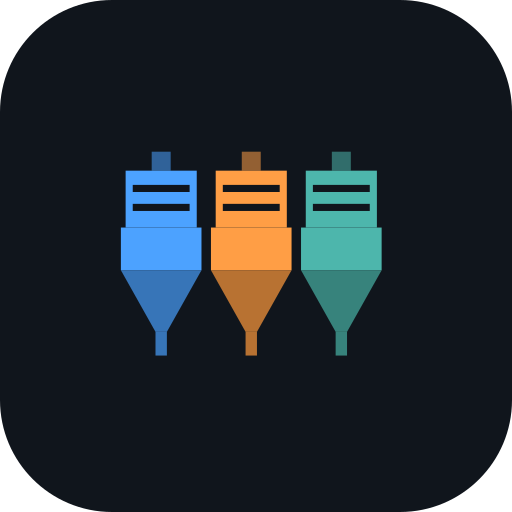
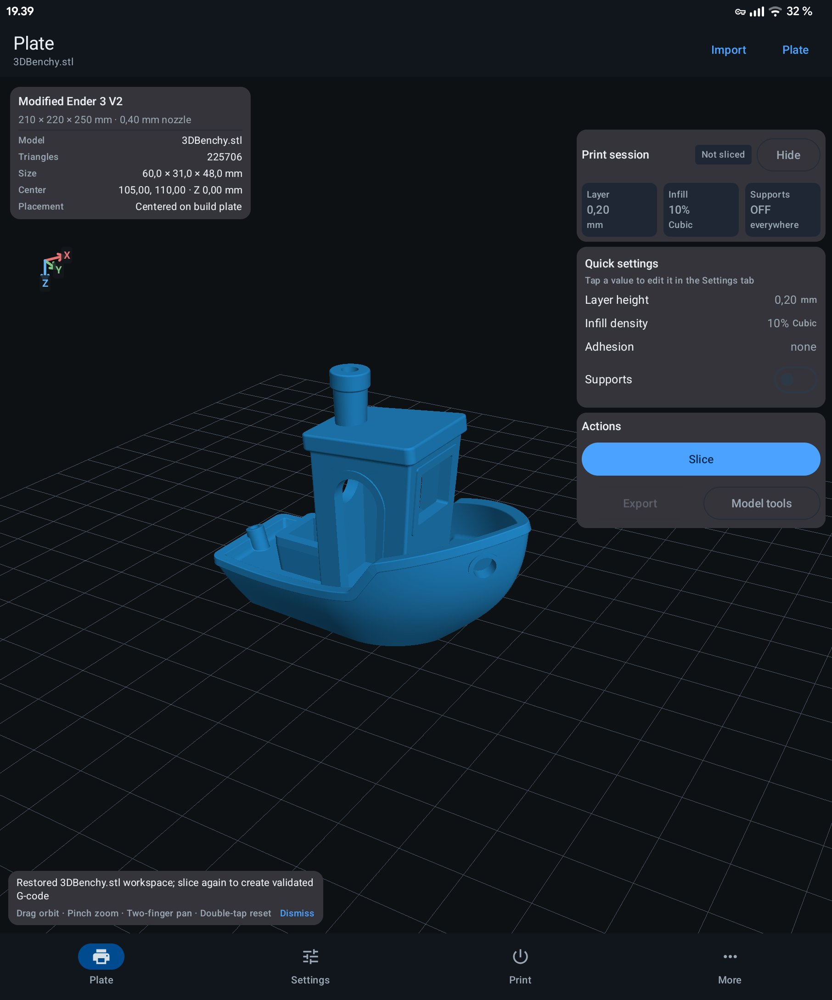
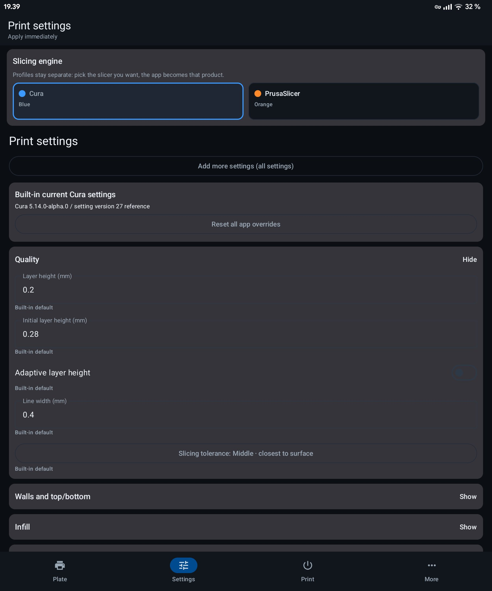
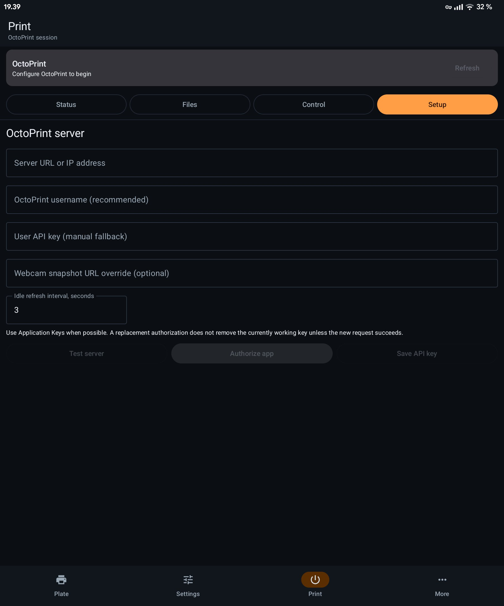
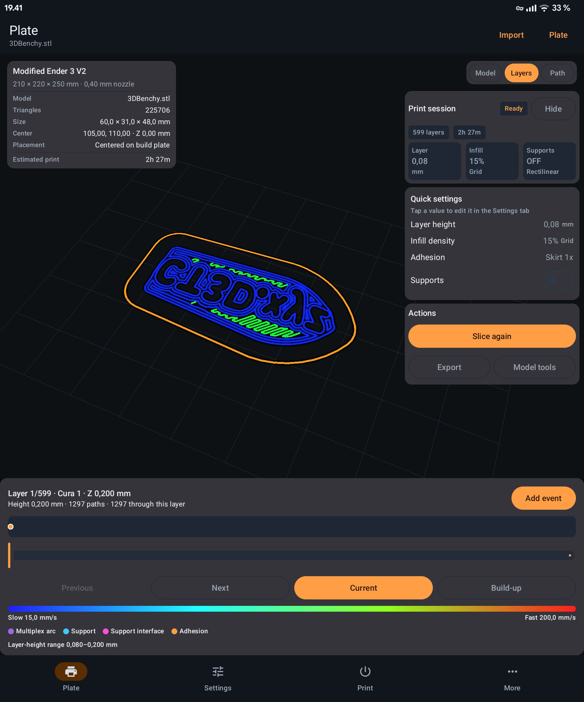
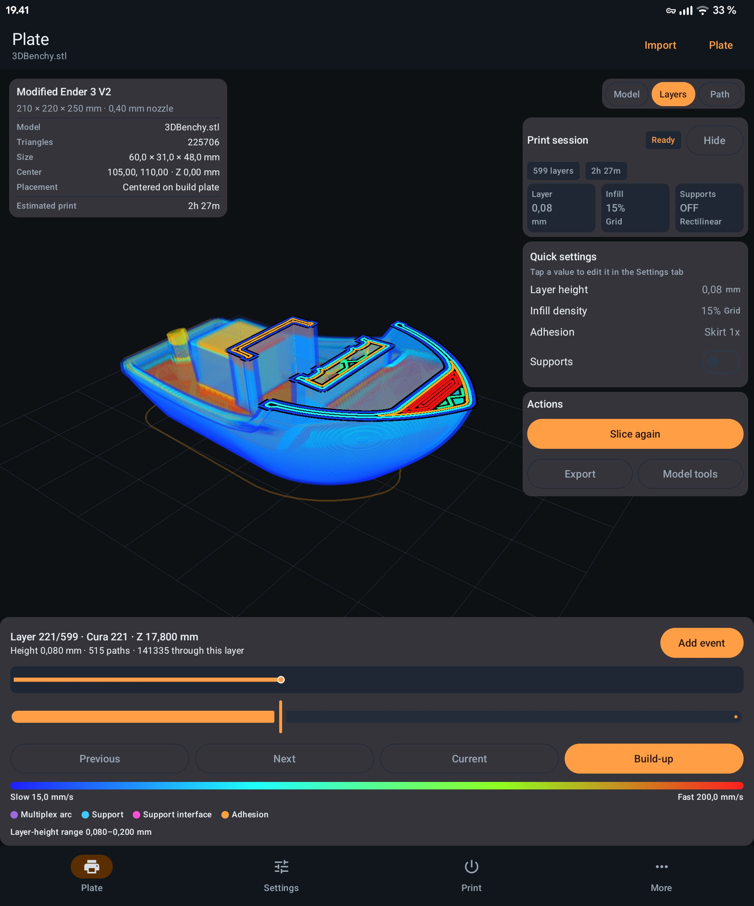
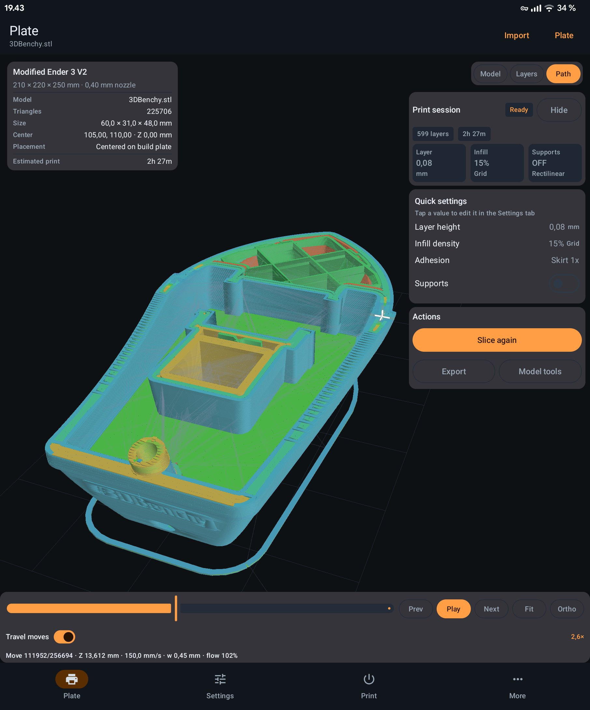
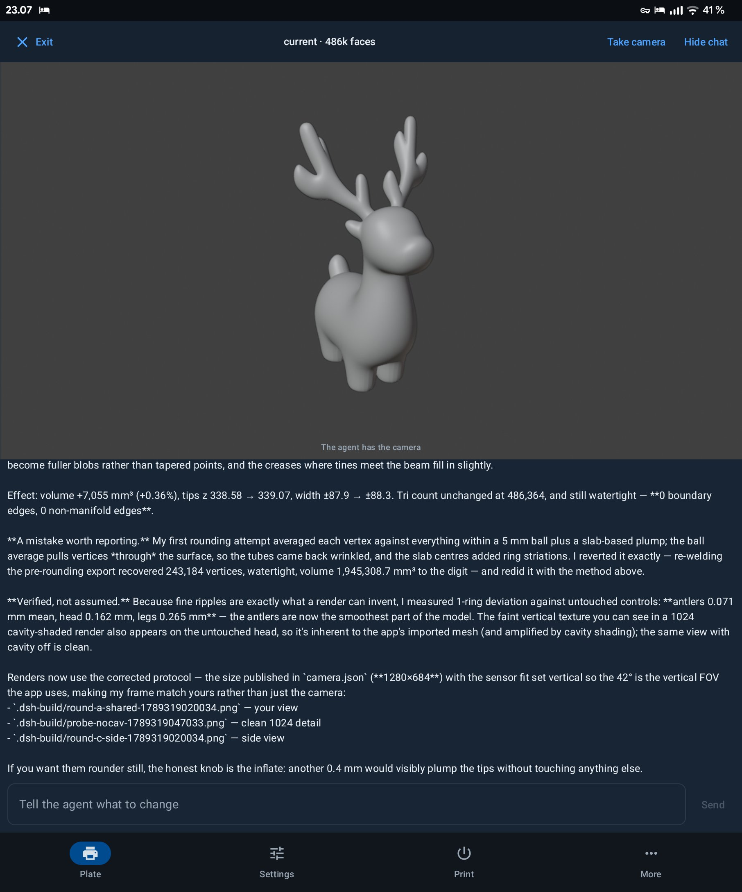

<p align="center">
  
</p>

# TrioSlicer

TrioSlicer (formerly DuoSlicer, and EnderSlicerCura before that) is an Android-first front end for
**CuraEngine, PrusaSlicer and OrcaSlicer** - importing, preparing, slicing, previewing and sending 3D
prints from a phone or foldable. It is **1.3.6** and runs on Android 10+ on **ARM64**, with all three
engines cross-compiled for the phone together with their own upstream profile systems: CuraEngine
**5.14.0-alpha.0**, PrusaSlicer **3.0.0-alpha11** and OrcaSlicer **2.4.2**. Its most-tested baseline is
a modified Creality Ender 3 V2.

> This is development software, not a complete Cura or PrusaSlicer replacement. Inspect every model, setting and generated G-code before printing.

## What it does

- **Slices on the phone, offline.** Three engines behind one switcher, each with its own settings and
  profile tree, and an accent colour that follows the active one: Cura (blue), PrusaSlicer (orange),
  OrcaSlicer (teal).
- **Saved profiles belong to one engine.** Print profiles and filaments are captured from, listed for
  and applied to the active engine, each behind its own type-and-range check, so the `Profiles &
  filament` sheet can only ever change the settings the running engine reads.
- **Takes the setup you already have.** Cura `.3mf` projects and `.curaprofile` files, PrusaSlicer
  `.ini` config bundles, OrcaSlicer presets and bundles, and STL models.
- **Plate, viewer and preview.** Move, rotate, scale, centre, lay flat and drop to bed; build-volume
  checks before slicing; OpenGL viewer; layer preview; nozzle-path view with speed-coloured beads.
- **Edits a sliced print without re-slicing.** Pause, filament change, temperature, fan, speed, flow,
  retraction, camera, message and guarded custom G-code, placed as layer events.
- **Automatic mesh leveling (AML)** for mriscoc firmware: the probe sequence covers the model footprint
  instead of the whole bed, so leveling takes seconds.
- **BumpMesh texturing, offline.** Planar, triplanar, cubic or cylindrical displacement mapping,
  100k-8M triangles.
- **Modelling with Blender 3.6 inside the app.** An AI agent drives the embedded engine over a local
  MCP socket, sees the same render you do, and hands the finished STL to the plate.
- **An AI assistant on the plate.** It talks to a DeepSeek harness you run yourself: ask about the
  model, paint a region to show what should change, or have a photograph turned into a printable STL
  on a remote GPU box.
- **Smart Infill and build-process thermal FEA (filaSim)**, solved natively on the phone, offline.
- **Experimental overhang paths** - arc (Multiplex), wave and the smart overhang strategy, mutually
  exclusive and off by default.
- **OctoPrint**: encrypted authorization, upload, select, print, file browser, monitoring, webcam and
  guarded printer controls.

## Screenshots

<p align="center">
  
  
  
  <br>
  <em>Plate &middot; print settings &middot; OctoPrint setup</em>
</p>

<p align="center">
  
  
  
  <br>
  <em>Layer preview (first layer, mid print) &middot; nozzle path</em>
</p>

<p align="center">
  
  <br>
  <em>Modelling: the embedded Blender engine, driven by the assistant</em>
</p>

## Install

Download `TrioSlicer-1.3.6.apk` from the [releases page](https://github.com/tomppi/trioslicer/releases)
and open it on the phone, or install it over adb:

```sh
adb install TrioSlicer-1.3.6.apk
```

Android 10+ on arm64-v8a. It is a **release** build - `android:debuggable` is off - signed with the
project's private release key, so it installs over 1.3.5 and keeps its data. An install from the
**original** 1.3.5 or earlier was signed with a debug key that is now retired, and Android refuses an
update across signing keys (`INSTALL_FAILED_UPDATE_INCOMPATIBLE`): uninstall it once first.

To check that a downloaded APK is ours (`apksigner` ships in the Android SDK's build-tools; the APK
carries a v2 signature, which `keytool -printcert -jarfile` cannot read):

```sh
apksigner verify --print-certs TrioSlicer-1.3.6.apk
```

The signer's certificate digest must be
`e4d88ac927ecb945e256e783ae431254785fd110fa9c78559f89d832128ea5d7`. The key itself, and how CI is
given it, are in [keystore/README.md](keystore/README.md).

## Importing your setup

The closest reproduction of a Cura setup comes from saving a **project** in Cura Desktop
(**File → Save Project…**, a `.3mf`) and using **Import settings from Cura project (.3mf)** in the
Settings tab: a project carries the machine definition, the quality and material settings and the
start/end G-code in one file. For print and filament settings alone, export a **profile**
(**File → Save Profile…**, a `.curaprofile`) and use **Import settings from Cura profile
(.curaprofile)**; when a profile has no machine definition the app falls back to its bundled Ender 3
V2 definitions. On the Prusa engine the equivalent is **Import settings from PrusaSlicer (.ini)**, and
OrcaSlicer presets and bundles import from the Orca settings sheet. Models import from the Plate's
**Import STL**.

Imported values become a persistent baseline: they stay in effect until you override them in the app,
and your overrides are tracked separately. Formula resolution is verified against the pinned
CuraEngine 5.14.0-alpha.0 resources, so projects from other Cura versions usually import - check the
resolved settings before a critical print.

## Current limitations

- Single printable model, single extruder; no duplicate/auto-arrange workflow or Cura plugins
- Smart Infill, thermal FEA, arc/wave overhangs and the smart overhang strategy need broader physical print validation
- High-density models and fine FEA grids may exceed the Android heap; thermal FEA lacks transient conduction and creep
- Non-planar slicing (CurviSlicer and conical) buffers the full transformed G-code in memory, so very large or very dense prints can exhaust the Android heap and fail with an out-of-memory error
- OctoPrint needs broader real-server validation; printer-specific firmware commands must be checked against the installed firmware
- The PrusaSlicer engine is packaged for **arm64-v8a** only; the x86_64 build was dropped because the shipped ABI is what device validation covers
- Cura previews estimate bead widths from the extrusion delta (Cura G-code carries no width markers), so a previewed width can differ slightly from what the engine planned
- The AI assistant is a client to a DeepSeek harness you run yourself, and photo-to-3D additionally needs a GPU box; neither is bundled, and replies are read from a polling projection rather than streamed

## Safety

Generated G-code is checked for valid extrusion temperatures, machine bounds, metadata and filename formatting before export, and remote printing requires explicit confirmation. Smart Infill and thermal FEA are engineering aids, not certified analyses — validate loads, constraints, material data, print orientation and safety factors before relying on them. Always verify the printer condition, model placement, build volume, temperatures, filament, first layer and custom G-code; terminal commands can move axes, heat the printer, modify firmware state or stop a print.

## Documentation

- [docs/TECHNICAL.md](docs/TECHNICAL.md) - building it, where the five engines come from, the verification tasks, CI, and how releases are signed
- [keystore/README.md](keystore/README.md) - the release key and how to verify a downloaded APK
- [AI_ASSISTANT.md](AI_ASSISTANT.md) and [BLENDER_MCP_INTEGRATION.md](BLENDER_MCP_INTEGRATION.md) - the harness the assistant talks to, and the embedded Blender engine
- [docs/octoprint-integration.md](docs/octoprint-integration.md) and [docs/skills/](docs/skills/) - printer integration, and the assistant's skill files
- [webviewdp](https://github.com/tomppi/webviewdp) - a minimal Android WebView app that wraps a harness's own web UI for the same phone
- [docs/smart-infill.md](docs/smart-infill.md), [docs/non-planar-curvislicer.md](docs/non-planar-curvislicer.md), [docs/ui-style-guide.md](docs/ui-style-guide.md) - feature and UI notes
- [CHANGELOG.md](CHANGELOG.md) and [THIRD_PARTY_NOTICES.md](THIRD_PARTY_NOTICES.md)

## License

TrioSlicer is distributed under GNU AGPL-3.0-or-later because it links to CuraEngine. The embedded BumpMesh and filaSim source are retained under `AGPL-3.0-only`. See [`THIRD_PARTY_NOTICES.md`](THIRD_PARTY_NOTICES.md). UltiMaker, Cura and PrusaSlicer are trademarks of their respective owners; TrioSlicer is not an official UltiMaker, Creality, Prusa Research or CNC Kitchen application.
