<p align="center">
  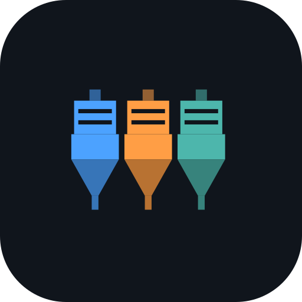
</p>

# TrioSlicer

TrioSlicer is an Android-first front end for **CuraEngine, PrusaSlicer and OrcaSlicer** - importing,
preparing, slicing, previewing and sending 3D prints from a phone or foldable, through **OctoPrint**
or either **Klipper** host (**Phone Klipper**, or **PC Klipper** over Moonraker), and modelling in
an embedded **Blender 3.6** or in **parametric CAD**. It runs on Android 10+ on **ARM64** and nothing else - the engines are
built for `arm64-v8a` alone - with all three cross-compiled for the phone together with their own
upstream profile systems: CuraEngine **5.14.0-alpha.0**, PrusaSlicer **3.0.0-alpha11** and
OrcaSlicer **2.4.2**. Its most-tested baseline is a modified Creality Ender 3 V2.

> This is development software, not a complete Cura or PrusaSlicer replacement. Inspect every model, setting and generated G-code before printing.

## What it does

- **Slices on the phone, offline.** Three engines behind one switcher, each with its own settings and
  profile tree, and an accent colour that follows the active one: Cura (blue), PrusaSlicer (orange),
  OrcaSlicer (teal).
- **Saved profiles belong to one engine.** Print profiles and filaments are captured from, listed for
  and applied to the active engine, each behind its own type-and-range check, so the `Profiles &
  filament` sheet can only ever change the settings the running engine reads.
- **Takes the setup you already have.** Cura `.3mf` projects and `.curaprofile` files, PrusaSlicer
  `.ini` config bundles, OrcaSlicer presets and bundles, and models as STL, 3MF, STEP or IGES.
- **Plate, viewer and preview.** Several models on the plate, packed by the app's own arranger
  (Auto arrange or Manual) or one at a time with a clearance check; move, rotate, scale, centre,
  lay flat and drop to bed the selected part; build-volume
  checks before slicing; OpenGL viewer; layer preview; nozzle-path view with speed-coloured beads.
- **Edits a sliced print without re-slicing.** Pause, filament change, temperature, fan, speed, flow,
  retraction, camera, message and guarded custom G-code, placed as layer events.
- **Automatic mesh leveling (AML)** for mriscoc firmware: the probe sequence covers the model footprint
  instead of the whole bed, so leveling takes seconds.
- **Drives a Klipper printer itself, from either end.** The board can be driven by a Klipper host
  running inside the app (**Phone Klipper**) or by a computer on the network running Moonraker
  (**PC Klipper**); the Print screen switches between them beside OctoPrint. Everything that
  belongs to the printer rather than the host - the saved calibrations, the bed meshes, the
  motion limits - can be compared between the two and copied one way or the other, and each
  file's date is shown so the newer setting is known. **KAMP** ships with the phone host, with a
  switch on its own screen in the printer's menus: when a start script measures no mesh of its
  own, the app inserts one before the first extruding move, and KAMP fits it to the printed area.
  The two G-code routes, Marlin for OctoPrint and Klipper for the hosts, are separate code with
  a guard that keeps them so.
- **Input shaping, measured with the phone.** The printer plays Klipper's own resonance sweep
  while the phone records itself as the accelerometer Klipper has not got, and the peaks that
  survive a change of position are the machine's rather than the phone's. Step by step in
  [docs/INPUT_SHAPING.md](docs/INPUT_SHAPING.md).
- **BumpMesh texturing, offline.** Planar, triplanar, cubic or cylindrical displacement mapping,
  100k-8M triangles.
- **Modelling with Blender 3.6 inside the app.** An AI agent drives the embedded engine over a local
  MCP socket, sees the same render you do, and hands the finished STL to the plate.
- **Parametric CAD, in the app.** A second modelling engine runs **build123d** on
  **OpenCASCADE** under the app's own Python, so a part is exact geometry rather than a mesh:
  real cylinders, fillets that are round, and a **STEP** file that carries design intent. It has
  its own **CAD** menu beside Blender's, and the assistant sees the engine it is driving there.
  It renders offscreen so you can see the result, and exports **SVG**, **DXF** and hidden-line
  technical drawings for flat parts.
- **An AI assistant on the plate.** It talks to a DeepSeek harness you run yourself: ask about the
  model, paint a region to show what should change, or have a photograph turned into a printable STL
  on a remote GPU box.
- **Smart Infill and build-process thermal FEA (filaSim)**, solved natively on the phone, offline.
- **Experimental overhang paths** - arc (Multiplex), wave and the smart overhang strategy, mutually
  exclusive and off by default.
- **OctoPrint**: encrypted authorization, upload, select, print, file browser, monitoring, webcam and
  guarded printer controls.

## Screenshots

<p align="center">
  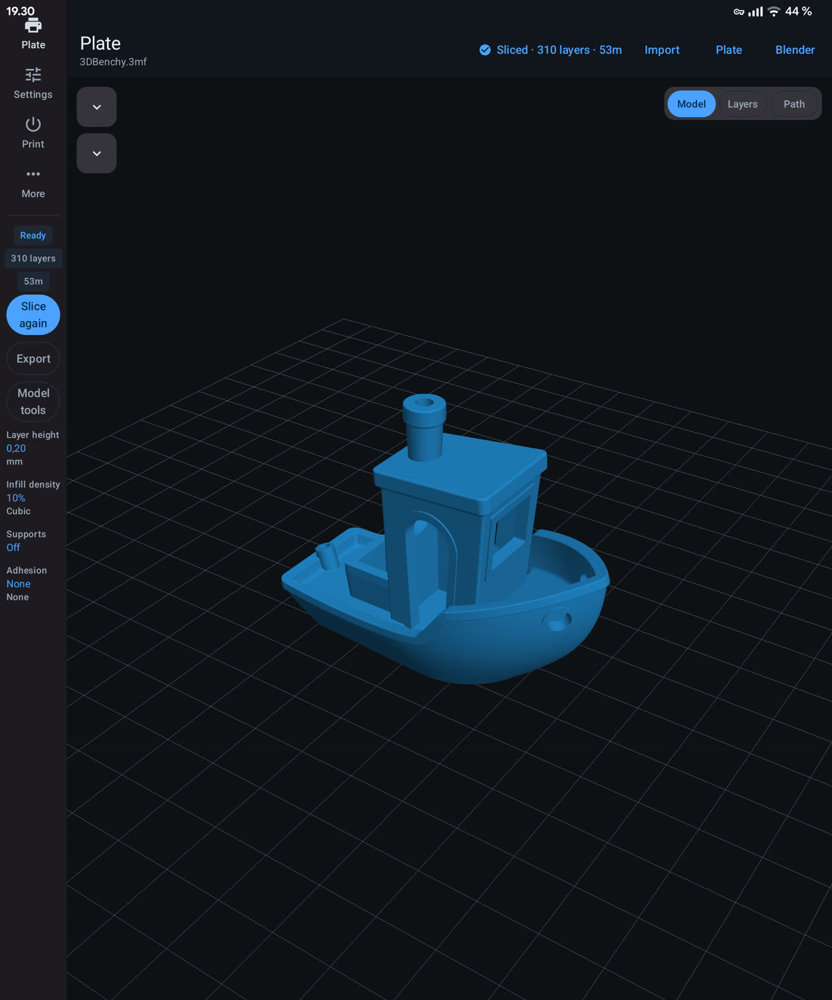
  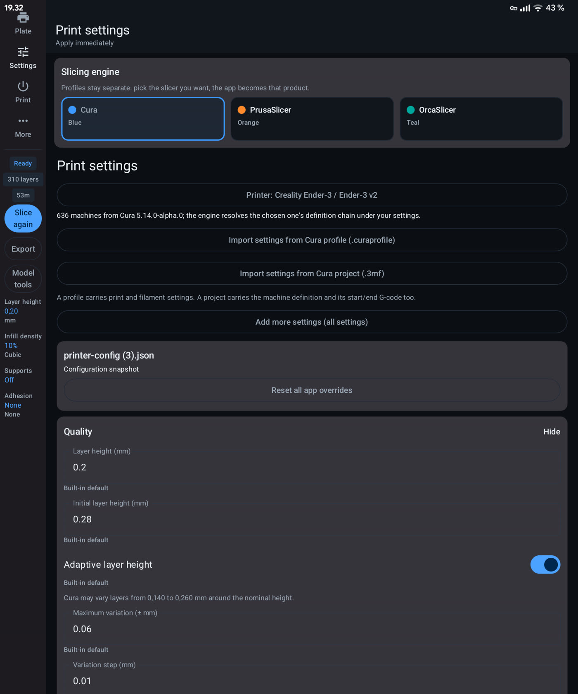
  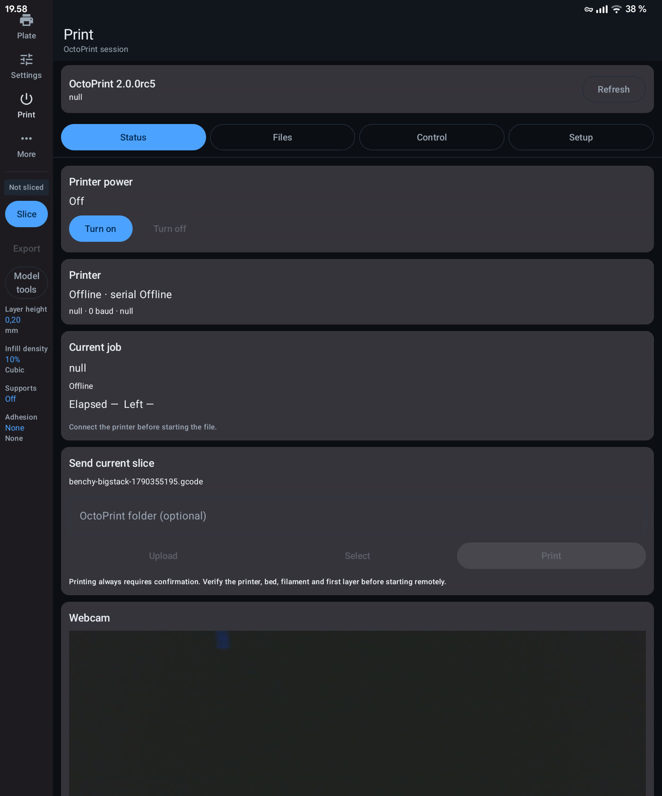
  <br>
  <em>Plate &middot; print settings &middot; OctoPrint status, printer power included</em>
</p>

<p align="center">
  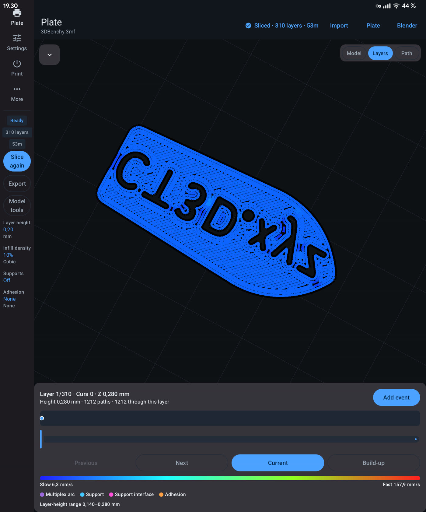
  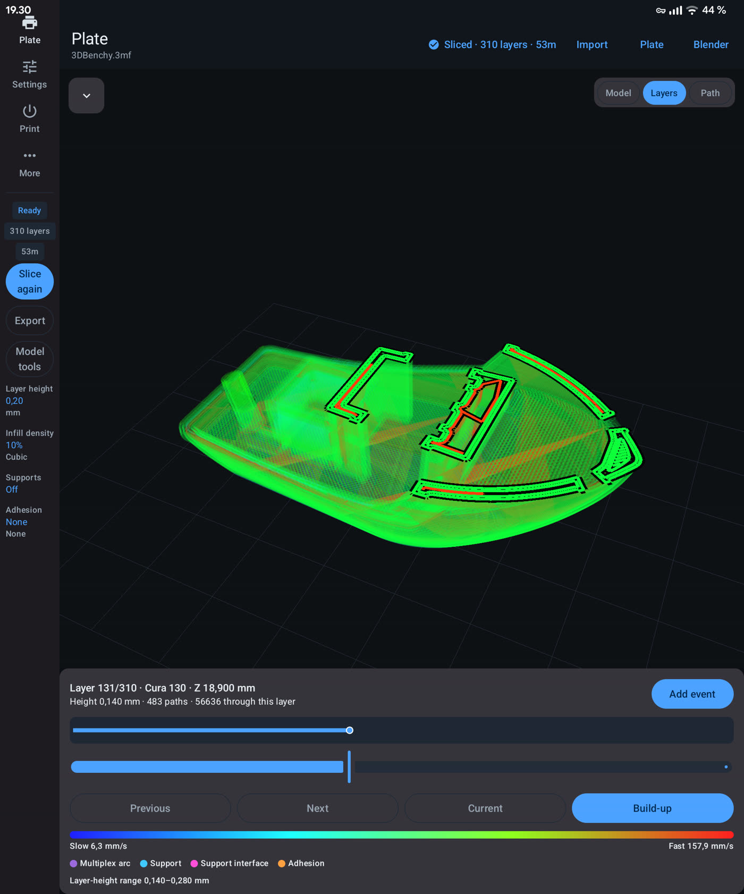
  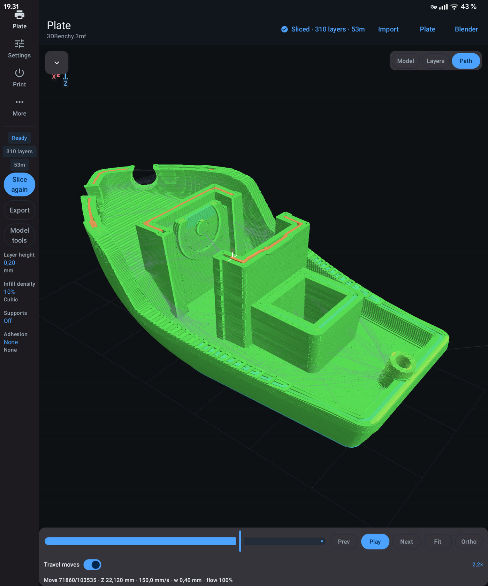
  <br>
  <em>Layer preview (first layer, mid print) &middot; nozzle path</em>
</p>

<p align="center">
  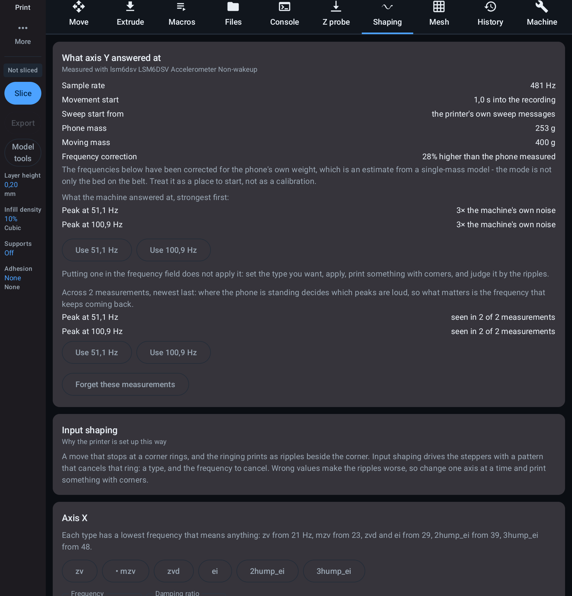
  <br>
  <em>Shaping: the phone is the accelerometer, and the printer's own sweep is the test</em>
</p>

<p align="center">
  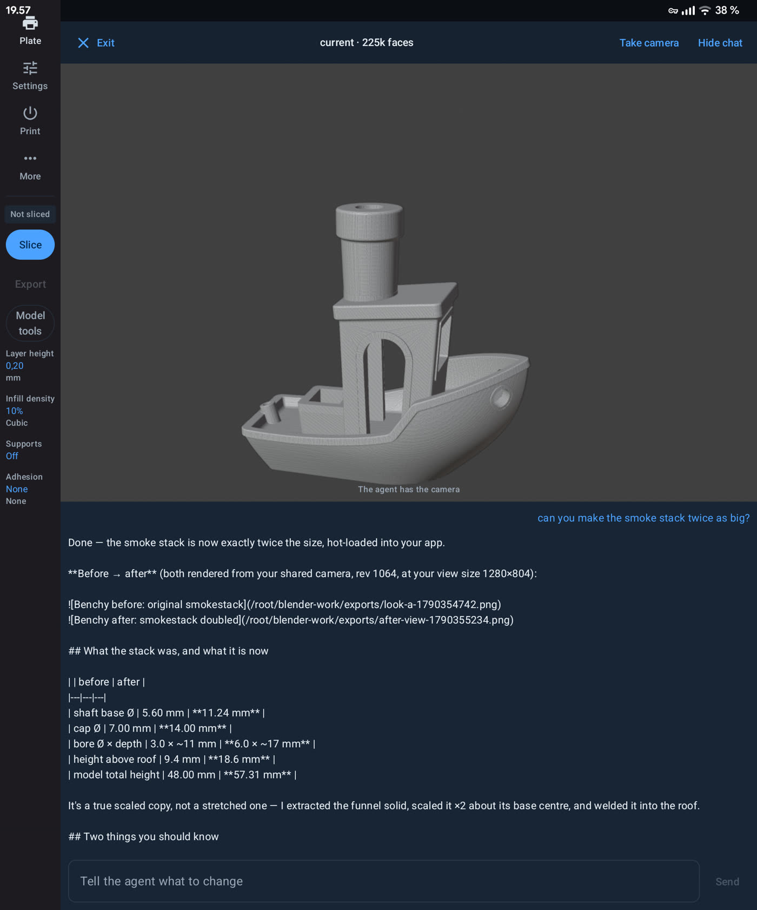
  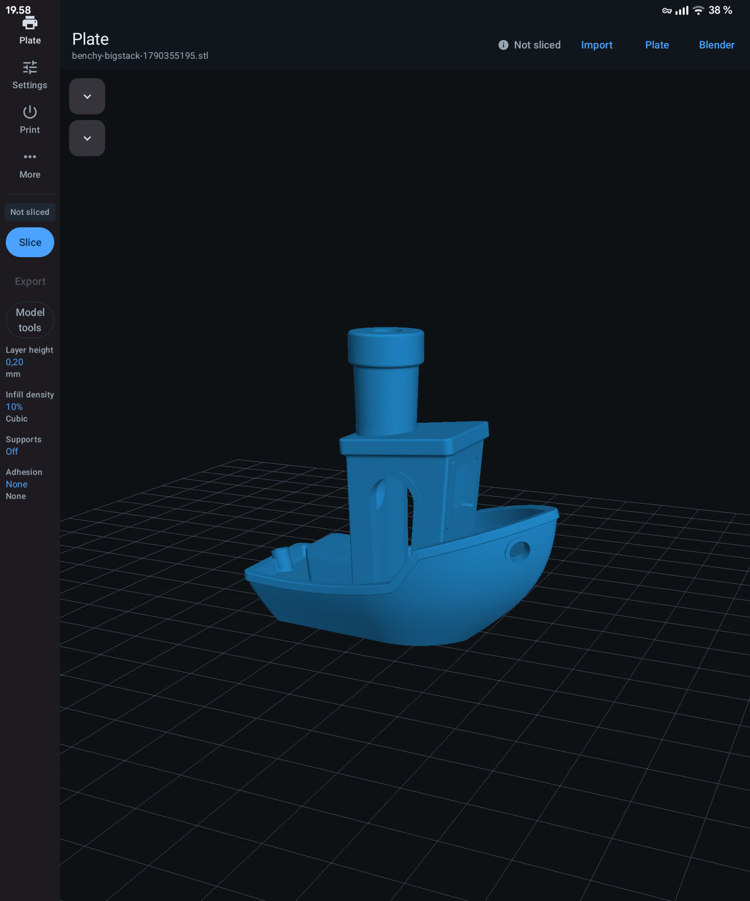
  <br>
  <em>Modelling: the embedded Blender engine driven by the assistant &middot; what it handed back to the plate</em>
</p>

<p align="center">
  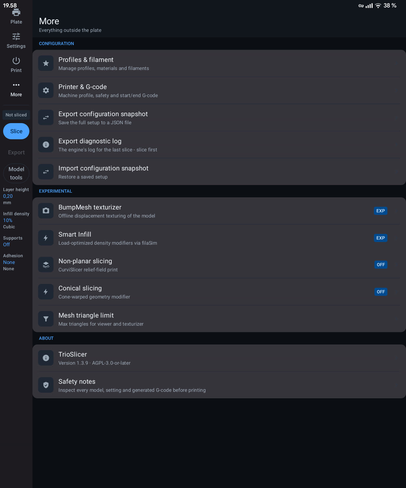
  <br>
  <em>More: profiles, the printer and its G-code, the experimental tools</em>
</p>

## Install

Download the latest `TrioSlicer-<version>.apk` from the
[releases page](https://github.com/tomppi/trioslicer/releases).

Android 10+ on **arm64-v8a** only. The engines are 64-bit ARM, so an older 32-bit phone may accept
the install and then have no engine to run: check the device before downloading.

To check that a downloaded APK is ours (`apksigner` ships in the Android SDK's build-tools; the APK
carries a v2 signature, which `keytool -printcert -jarfile` cannot read):

```sh
apksigner verify --print-certs TrioSlicer-<version>.apk
```

The signer's certificate digest must be
`e4d88ac927ecb945e256e783ae431254785fd110fa9c78559f89d832128ea5d7` (older `apksigner` prints
the same digest as `E4:D8:8A:C9:...`; the bytes are what matter). The key itself, and how CI is
given it, are in [keystore/README.md](keystore/README.md).

## Importing your setup

The closest reproduction of a Cura setup comes from saving a **project** in Cura Desktop
(**File → Save Project…**, a `.3mf`) and using **Import settings from Cura project (.3mf)** in the
Settings tab: a project carries the machine definition, the quality and material settings and the
start/end G-code in one file. For print and filament settings alone, export a **profile**
(**File → Save Profile…**, a `.curaprofile`) and use **Import settings from Cura profile
(.curaprofile)**; when a profile has no machine definition the app falls back to its bundled Ender 3
V2 definitions. On the Prusa engine the equivalent is **Import settings from PrusaSlicer (.ini)**, and
OrcaSlicer presets and bundles import from the Orca settings sheet. Models import from the Plate's
**Import** menu (**Import model**: STL, 3MF, STEP or IGES).

Imported values become a persistent baseline: they stay in effect until you override them in the app,
and your overrides are tracked separately. Formula resolution is verified against the pinned
CuraEngine 5.14.0-alpha.0 resources, so projects from other Cura versions usually import - check the
resolved settings before a critical print.

## Current limitations

- Single extruder; no duplicate command or Cura plugins
- Multi-object plates slice on all three engines, but per-object cancellation needs PrusaSlicer or
  OrcaSlicer - CuraEngine emits no per-object markers - and one-at-a-time printing of several
  objects with an imported Cura profile is refused
- High-density models and fine FEA grids may exceed the Android heap; thermal FEA lacks transient conduction and creep
- Non-planar slicing and conical slicing buffer the full transformed G-code in memory, so very large or very dense prints can exhaust the Android heap and fail with an out-of-memory error
- Cura previews estimate bead widths from the extrusion delta (Cura G-code carries no width markers), so a previewed width can differ slightly from what the engine planned
- The APK is about 500 MB, most of it the embedded Blender and CAD engines, so it is a large
  download and a large install
- The AI assistant is a client to a DeepSeek harness you run yourself, and photo-to-3D additionally needs a GPU box; neither is bundled, and replies are read from a polling projection rather than streamed

## Safety

Generated G-code is checked for valid extrusion temperatures, machine bounds, metadata and filename formatting before export, and remote printing requires explicit confirmation. Smart Infill and thermal FEA are engineering aids, not certified analyses — validate loads, constraints, material data, print orientation and safety factors before relying on them. Always verify the printer condition, model placement, build volume, temperatures, filament, first layer and custom G-code; terminal commands can move axes, heat the printer, modify firmware state or stop a print.

## Documentation

- [docs/TECHNICAL.md](docs/TECHNICAL.md) - building it, where the six engines come from, the verification tasks, CI, and how releases are signed
- [keystore/README.md](keystore/README.md) - the release key and how to verify a downloaded APK
- [Calibrating the input shaper with a phone](docs/INPUT_SHAPING.md)
- [AI_ASSISTANT.md](AI_ASSISTANT.md) and [BLENDER_MCP_INTEGRATION.md](BLENDER_MCP_INTEGRATION.md) - the harness the assistant talks to, and the embedded Blender engine
- [docs/KLIPPER_UI.md](docs/KLIPPER_UI.md) - the printer's screens, KAMP among them, and what each reads from klippy
- [docs/octoprint-integration.md](docs/octoprint-integration.md) and [docs/skills/](docs/skills/) - printer integration, and the assistant's skill files
- [webviewdp](https://github.com/tomppi/webviewdp) - a minimal Android WebView app that wraps a harness's own web UI for the same phone
- [docs/smart-infill.md](docs/smart-infill.md), [docs/non-planar.md](docs/non-planar.md), [docs/ui-style-guide.md](docs/ui-style-guide.md) - feature and UI notes
- [docs/gcode-correctness/](docs/gcode-correctness/) - one document per engine comparing the G-code this
  app produces against the real slicer, with the model, the preset and every difference found
- [CHANGELOG.md](CHANGELOG.md) and [THIRD_PARTY_NOTICES.md](THIRD_PARTY_NOTICES.md)

### Does it slice like the real thing?

The app does not reimplement these slicers - it runs them. CuraEngine and PrusaSlicer are the vendor
binaries, and the OrcaSlicer route is a headless driver over the same `libslic3r`, so with identical
settings the tool paths should be identical rather than merely similar. They are:

| engine | supports off | supports on |
|---|---|---|
| CuraEngine 5.14.0-alpha.0 | walls, skin and infill **exact** | exact, except **tree support** |
| PrusaSlicer 3.0.0-alpha11 | **0.9992** | **0.9696** - path length within 0.0002 % |
| OrcaSlicer 2.4.2 | **0.9776** | 0.9776 |

Every figure is measured against a control run of the reference against itself, because CuraEngine does
not reproduce its own output at the thread count it is given: two runs with identical arguments agree on
74.1 % of segments, and single-threaded they are byte-identical. Tree support is chaotic in the engine
itself - re-running the app's own engine on the same phone changes it while every wall, skin and infill
segment stays identical - so support is not a correctness signal for any slicer.

[docs/gcode-correctness/](docs/gcode-correctness/) has the models, presets, settings and every
difference; `scripts/compare-gcode.py` is the comparator.

## License

TrioSlicer is distributed under GNU AGPL-3.0-or-later because it links to CuraEngine. The embedded
BumpMesh and filaSim source are retained under `AGPL-3.0-only`. See
[`THIRD_PARTY_NOTICES.md`](THIRD_PARTY_NOTICES.md).

`SPDX-License-Identifier: AGPL-3.0-or-later`

The full text is in [`LICENSE`](LICENSE), and a complete copy of the GNU Affero General Public License
version 3 must accompany distributed builds. This program is distributed in the hope that it will be
useful, but WITHOUT ANY WARRANTY; without even the implied warranty of MERCHANTABILITY or FITNESS FOR A
PARTICULAR PURPOSE.

UltiMaker, Cura and PrusaSlicer are trademarks of their respective owners; TrioSlicer is not an official
UltiMaker, Creality, Prusa Research or CNC Kitchen application.
